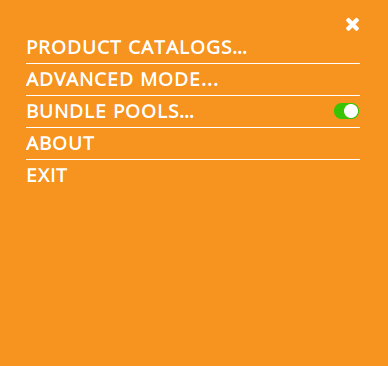
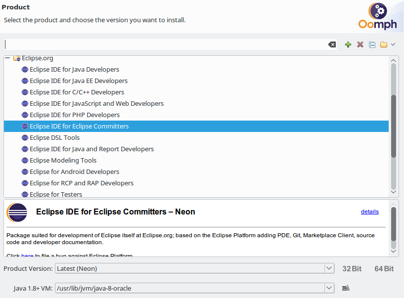
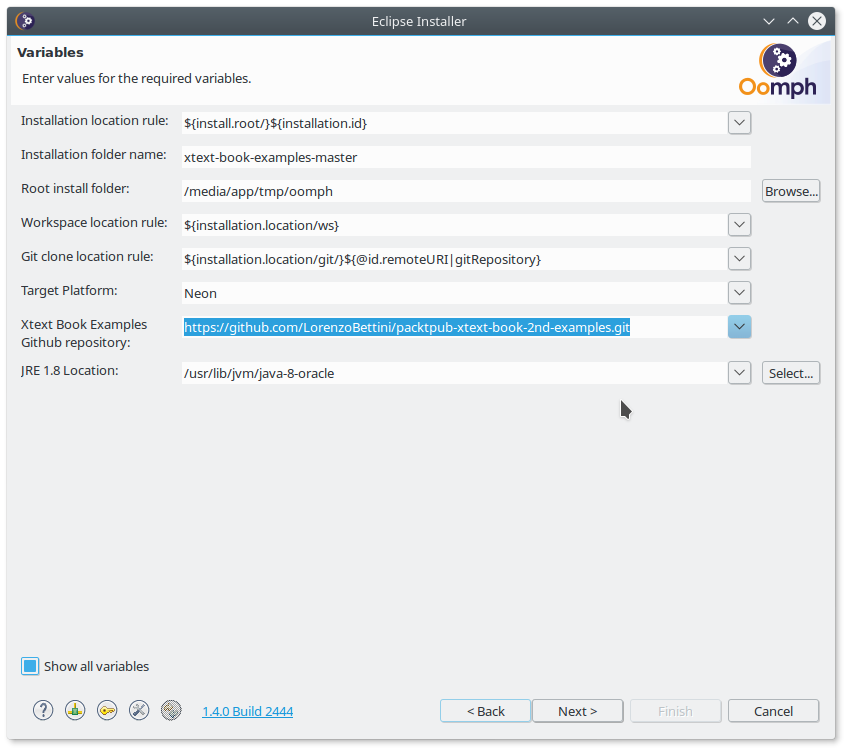

You could simply clone locally this git repository, but please keep in mind that no generated file is present in the repository, thus if you import the projects manually you will have to run all the MWE2 workflows for all the examples.  We suggest instead that you use the following automatic procedure.

This page explains how to easily set up your Eclipse installation and workspace with the  source code of the examples of the book.

Remember that you need Java 8.

## Set up your Eclipse Workspace
1. Download and start the [Eclipse Installer](https://wiki.eclipse.org/Eclipse_Oomph_Installer).
2. On the initial page, click on the *Switch to Advanced Mode* button in the top right.
 
 
3. On the *Product* page, select *Eclipse IDE for Eclipse Committers*.
 
4. On the *Projects* page, click on the "+" icon (*Add user projects*) in the top right.
 
5. In the *Add User Projects* dialog, select *Github Projects* in the *Catalog* dropdwon and in the field *Resource URIs* paste the following URL. TODO
6. Select the "Xtext Book Examples" node and press Next.
 
7. Choose your preferred installation settings on the *Variables* page; in particular, select the checkbox *Show all variables* and in the dropdwon *Xtext Book Examples Github repository* make sure you select *HTTPS (read-only, anonymous)*.
 
8. Finish the wizard, drink a cup of coffee, the Eclipse distribution will be downloaded and the tooling plug-ins installed (during this stage you will be asked to accept some licences), after that, the new Eclipse instance will be run and the workspace will be set up (including the cloning of the git repository); you may want to close the "Welcome" page when the new Eclipse is started.  During this stage, all the Xtext example DSLs will be generated (running all the MWE2 workflows).
9. Please be patient: many artifacts will have to be downloaded during the set up, including Eclipse plug-ins, Maven artifacts and Gradle distribution. Please, make sure you have a good Internet connection.

## Contribute via Fork
All you need is a [GitHub](https://github.com/) account.

 1. Make sure there is a GitHub issue for what you want to work on.
 2. Announce in the comments section that you want to work on the issue. Also describe the solution you want to implement. To improve the chances for your contribution to be accepted, you'll want to wait for the feedback of the committers.
 3. Implement your change.
 4. Push your changes to your forked repository. It is recommended to create a separate branch, this will make it easier to include the feedback from committers and update your changes.
 5. Create a [pull request](https://help.github.com/articles/using-pull-requests/).

## Run a full build locally

TODO
